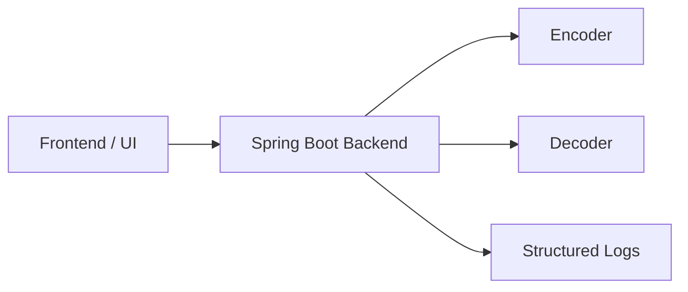

# shamir-secret-dnp

Учебный проект по Shamir Secret Sharing для команды из 5 человек.

Цель этой структуры: не реализовать все заранее, а четко раздать зоны ответственности, контракты и правила интеграции, чтобы каждый разработчик мог работать в своей ветке без лишних согласований.

## Общая схема

## Принцип архитектуры

- frontend работает только через backend
- backend оркестрирует вызовы и держит HTTP-контракт
- encoder отвечает только за разбиение секрета
- decoder отвечает только за восстановление секрета
- алгоритм и transport-слой не смешиваются

## Документация по задачам

- [Frontend task](docs/frontend.md)
- [Backend task](docs/backend.md)
- [Encoder task](docs/encoder.md)
- [Decoder task](docs/decoder.md)

Каждый участник должен читать в первую очередь свой файл и не менять внешний контракт без согласования.

## Командная работа

- `main` только для стабильного состояния
- каждый работает в своей ветке
- merge в `main` только через PR
- один PR должен закрывать одну понятную задачу

Рекомендуемые ветки:

- `feature/frontend`
- `feature/backend`
- `feature/encoder`
- `feature/decoder`

## Что стоит зафиксировать сразу

- backend-контракты запроса и ответа
- строковый формат `share`
- единый формат ошибки
- запрет логирования `secret` и полного списка `shares`

## Что из DNP здесь действительно оправдано

- `client-server`
- `stateless service`
- `contract-first`
- `validation at boundaries`
- `versioned API`
- `clear service boundaries`

## Ссылки

- Shamir paper: <https://web.mit.edu/6.857/OldStuff/Fall03/ref/Shamir-HowToShareASecret.pdf>
- Visualization: <https://iancoleman.io/shamir/>
