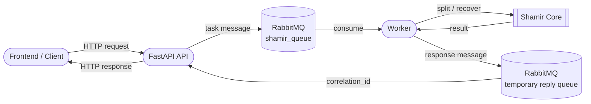
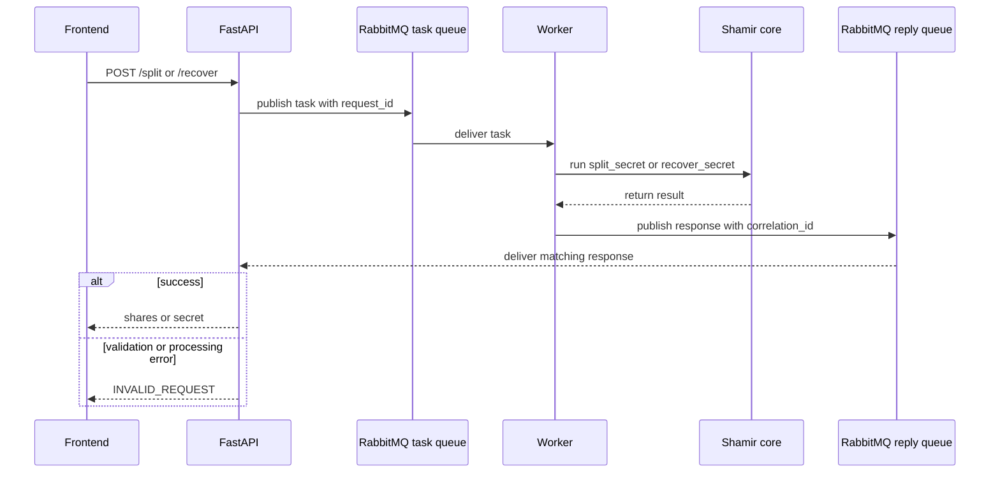
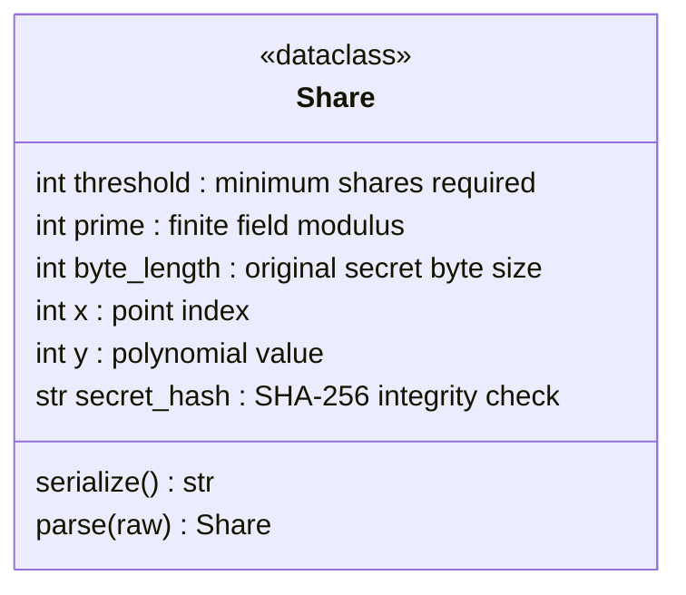

# Shamir Secret Sharing

[](https://www.python.org/)
[](https://fastapi.tiangolo.com/)
[](https://www.rabbitmq.com/)
[](https://docs.pytest.org/)

This project implements Shamir Secret Sharing for splitting a text secret into
multiple shares and reconstructing it from a threshold number of shares.

The backend uses FastAPI, RabbitMQ, and a worker process. The API does not call
the Shamir core directly. It sends a task to RabbitMQ, waits for the worker
response through a temporary reply queue, and returns the result to the client.

## Overview

- Split a UTF-8 text secret into `total_shares` serialized shares.
- Recover the original secret from at least `threshold` valid shares.
- Use SHA-256 to verify that the reconstructed secret matches the original.
- Log generation and reconstruction metadata for auditability.
- Use RabbitMQ to route work from the API process to the worker process.

## Architecture



This architecture is intentionally more complex than a simple synchronous API
that calls the Shamir functions directly. A simpler design would be enough for
small local demos. We chose the RabbitMQ worker flow because the project is also
about practicing distributed-system design: queue-based communication, worker
separation, request correlation, and failure boundaries.

Secrets and generated shares are not stored in files or a database on the
server. During request processing, the input message and response may exist for
a short time in RabbitMQ queues and in API/worker memory. After the response is
returned, the backend does not keep a saved copy.

## Message Flow



## Project Structure

```text
src/
├── api/        # FastAPI app and endpoints
├── broker/     # RabbitMQ client and worker
├── shamir/     # Core Shamir algorithm
└── frontend/   # UI work area
tests/          # Core/API tests
```

## Share Format

Each generated share is a serialized `Share` object. The integrity hash is stored
inside every share, so the API does not expose a separate `hash` field.



Serialized shares use `:` as a separator:

```text
threshold:prime:byte_length:x:y:hash
```

The separator is needed because fields such as `prime`, `y`, and `hash` can have
different lengths. Without a separator, the parser would not know where one
field ends and the next one starts.

Serialized share example:

```text
3:1f4a9c:5:1:19ad3f:2cf24dba5fb0a30e26e83b2ac5b9e29e...
```

## API Contract

### Split Secret

`POST /api/v1/secrets/split`

Request:

```json
{
  "secret": "hello",
  "threshold": 3,
  "total_shares": 5
}
```

Response:

```json
{
  "shares": ["..."],
  "share_count": 5,
  "request_id": "..."
}
```

The integrity hash is embedded into every serialized share. It is not returned
as a separate API field.

### Recover Secret

`POST /api/v1/secrets/recover`

Request:

```json
{
  "shares": ["share1", "share2", "share3"]
}
```

Response:

```json
{
  "secret": "hello",
  "request_id": "..."
}
```

Errors use this shape:

```json
{
  "code": "INVALID_REQUEST",
  "message": "insufficient shares",
  "request_id": "..."
}
```

## Quick Start

Install dependencies:

```bash
pip install -r requirements.txt
```

Start RabbitMQ:

```bash
brew services start rabbitmq
```

Run the worker:

```bash
cd src
python -m broker.worker
```

Run the API in another terminal:

```bash
cd src
python -m uvicorn api.main:app --reload
```

Example split request:

```bash
curl -X POST http://127.0.0.1:8000/api/v1/secrets/split \
  -H "Content-Type: application/json" \
  -d '{
    "secret": "hello",
    "threshold": 3,
    "total_shares": 5
  }'
```

Example recover request:

```bash
curl -X POST http://127.0.0.1:8000/api/v1/secrets/recover \
  -H "Content-Type: application/json" \
  -d '{
    "shares": ["share1", "share2", "share3"]
  }'
```

Run tests:

```bash
pytest
```

## Validation Checklist

- Hash integrity: `split` embeds a SHA-256 hash into every share, and `recover` verifies the reconstructed secret against that embedded hash.
- Insufficient shares: reconstruction with fewer than `threshold` shares fails.
- Audit logs: split and recover operations log request metadata without logging the original secret.

## Notes

- Shares are serialized as `threshold:prime:byte_length:x:y:hash`.
- The code uses finite field arithmetic over `GF(p)`, cryptographically secure randomness from `secrets`, and Lagrange interpolation for reconstruction.
- Do not log the original secret or the full list of shares.

## Demo and Report

- Demo API: [docs/demo.mov](docs/demo.mov)
- Demo Front: [docs/demo-front.mp4](docs/demo-front.mp4)
- PDF report: [docs/report.pdf](docs/report.pdf)


## Links

- Original paper: <https://web.mit.edu/6.857/OldStuff/Fall03/ref/Shamir-HowToShareASecret.pdf>
- Visualization: <https://iancoleman.io/shamir/>
